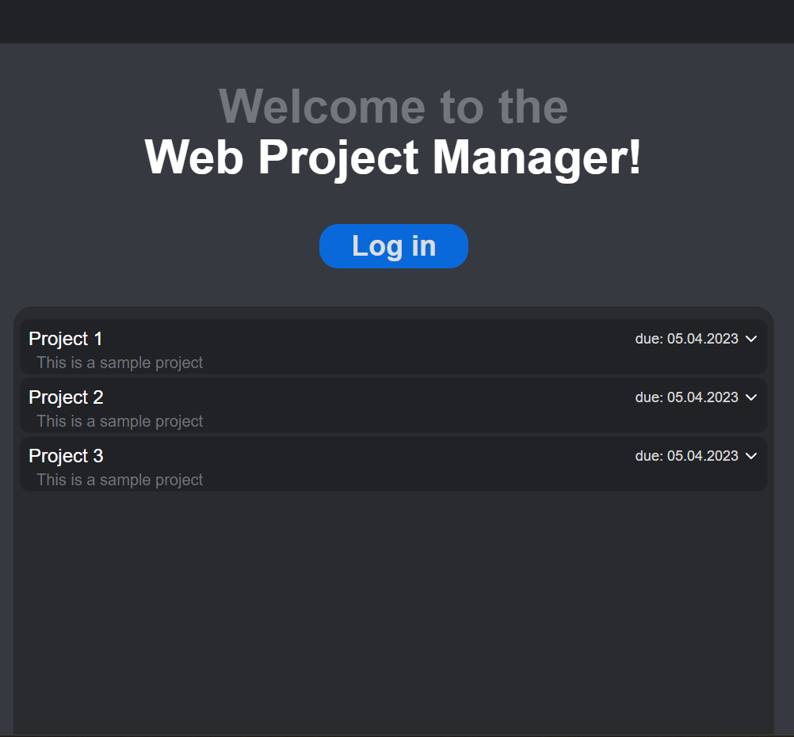

<a name="readme-top"></a>

<!-- PROJECT LOGO -->
<br />
<div align="center">
    

<h3 align="center">WebProjectManager</h3>

  <p align="center">
    ASP.NET Core Blazor Tool for managing projects
  </p>
</div>

<!-- ABOUT THE PROJECT -->
## About The Project

<div align="center">
  
</div>

<p align="right">(<a href="#readme-top">back to top</a>)</p>

### Built With

<image src="https://raw.githubusercontent.com/Indeedornot/README_icons/3454466b1b34e42f17c5104d222219c9485129b7/language_and_tools/square/c%23/c%23.svg" />
<image src="https://raw.githubusercontent.com/Indeedornot/README_icons/2cc2c6a6d95f2142441267c6f44467ed1c9224cf/language_and_tools/square/asp.net-core/asp.net-core.svg" style="background-color:white;" width=76 height=76/>
<image src="https://raw.githubusercontent.com/Indeedornot/README_icons/2cc2c6a6d95f2142441267c6f44467ed1c9224cf/language_and_tools/square/blazor/blazor.svg" width=76 height=76/>
<p align="right">(<a href="#readme-top">back to top</a>)</p>

<!-- GETTING STARTED -->
<!-- ## Getting Started

### Installation

1. Clone the repo
   ```sh
   git clone https://github.com/indeedornot/WPFWeather.git
   ```
3. Build the project
   ```sh
   dotnet build
   ```
4. Run the project
   ```js
   dotnet run
   ``` -->

<!-- <p align="right">(<a href="#readme-top">back to top</a>)</p> -->

<!-- USAGE EXAMPLES -->
## More
